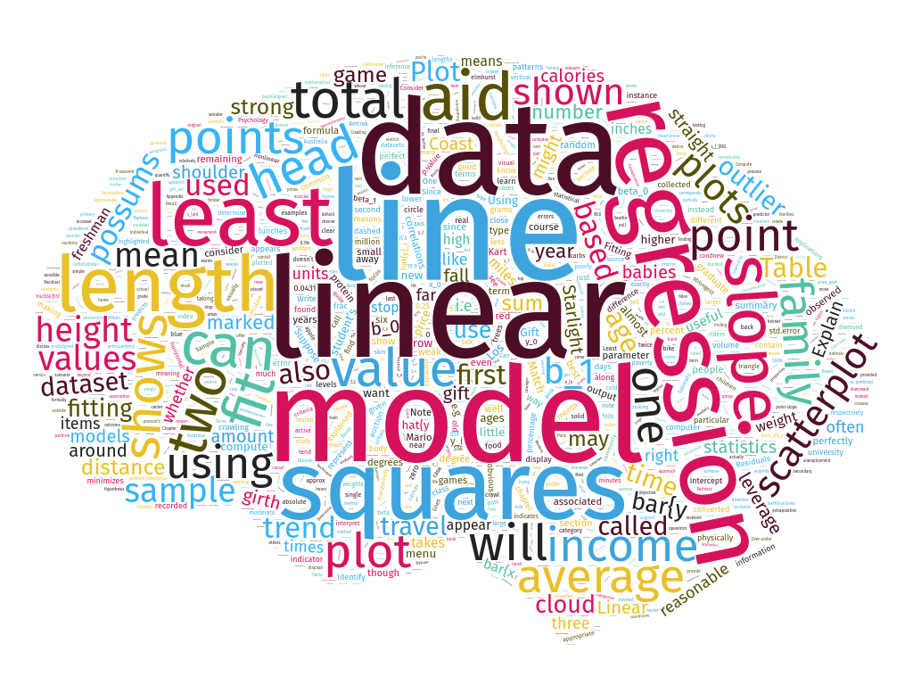

```{r setup, include=FALSE}
library(tidyverse)
library(learnr)
library(gradethis)

tutorial_options(
    exercise.checker = gradethis::grade_learnr,
    exercise.completion = FALSE
)
gradethis_setup(
    exercise.reveal_solution = FALSE
)

anscombe <- read_csv("data/cor_data.csv")
elp <- read_csv("data/elp.csv")
```

## Introduction

```{r, echo=FALSE, out.width="100%"}

```

In this session, we will use R to help us describe relationships between numerical variables.  Typically, the purpose in doing so is to see how well we can predict or explain differences in a **response** variable in terms of differences in an **explanatory** variable.  As we have seen, we have several useful tools to work with:  **scatterplots**, **correlation**, and **linear regression**.  We will also see, though, that we have to be careful about using these tools in order to avoid being fooled.

## Always plot your data

Numerical summaries of data are extremely useful and compact descriptions of things like central tendency and variability.  We have also seen how the Pearson correlation coefficient is a useful summary of the strength and direction of a relationship between numerical variables.  But these numerical summaries can also be misleading, as we shall see in the following example.  The data in this example are simulated, but representative of things that can happen in real data.  They were introduced by Anscombe, and so these data are called `anscombe` in R.

### Correlations for different sets of measurements

There are four groups of observations in these data.  The groups are labeled "A", "B", "C", and "D".  Observations were made on two variables, labeled "X" and "Y".

```{r}
head(anscombe)
```

Using R, we can quickly get numerical summaries of these data.  The code below provides the mean and standard deviation of the X and Y values in each group, as well as the correlation between X and Y in each group.

```{r}
anscombe %>%
    group_by(Group) %>%
    summarize(Mean_X = mean(X), Mean_Y = mean(Y), SD_X = sd(X), SD_Y = sd(Y), r = cor(X, Y))
```

From these summaries, it looks like there are basically no differences at all between the groups!

### Scatterplots

Rather than a numerical summary, now let's use R to visually summarize these data using scatterplots.  We will put the `X` variable on the horizontal ("x") axis and the `Y` variable on the vertical ("y") axis.  We will use `Group` as a "facetting" variable:

```{r}
anscombe %>%
    ggplot(aes(x=X, y=Y)) +
    geom_point() +
    facet_wrap("Group")
```

---

**Exercise 1**

Based on the scatterplots above, respond to the following questions:

a. For each scatterplot, describe the relationship it seems to show between the two variables.
b. For each scatterplot, say whether you think the correlation coefficient (`r`) provides a good summary of the relationship between the two variables and why.

---

## And now for a word

*Psycholinguistics* is the study of the perceptual and cognitive processes involved in learning, understanding, and producing language.  One of the ways psycholinguists study language processing is using a "lexical decision task".  In a lexical decision task, participants are shown strings of letters; sometimes, these make real words (like "AUTHOR") and sometimes they don't (like "AWBLOR").  The time someone takes to decide that a string of letters is a real word (AUTHOR) is a measure of how easily knowledge about that word can be accessed.  By looking at the relationships between **lexical decision time (LDT)** and different properties of a word, we can begin to understand the processes by which we organize and access our knowledge of language.  In other words, lexical decision time tells us how the "mental dictionary" is structured.

The [English Lexicon Project](https://elexicon.wustl.edu/) has been collecting this kind of data from a lot of people with many different words in the English language.  They report the mean lexical decision time for a word, along with a number of other properties of the word.  We will treat the mean lexical decision time as the **response variable** and examine its relationships to a number of other **explanatory variables**.

### Check out the data

In honor of the English Lexicon Project, the dataset we are using is labeled `elp`.

```{r}
head(elp)
```

Each case/observation in this dataset is a particular word.  In addition to lexical decision time, there are several other potential explanatory variables that have been measured for each word.

### Examine the distribution of lexical decision times

The `LDT` variable contains the lexical decision time for each word in the dataset.  LDT is measured in milliseconds.  Let us first examine the distribution of lexical decision times.

---

**Exercise 2**

Fill in the blanks in the code below to make a histogram of lexical decision times across all words, using a binwidth of 20 milliseconds.  *Hint:* Remember that you will need

1. the name of the dataset;
2. the name of the variable in that dataset that contains the lexical decision times;
3. the name of the function we use to make a histogram; and
4. to tell R the width of the bins we want to use.

```{r ldt_hist, exercise = TRUE, exercise.eval = FALSE}
___ %>%
  ggplot(aes(x = ___)) +
  ___(binwidth = ___)
```

```{r ldt_hist-solution}
elp %>%
  ggplot(aes(x = LDT)) +
  geom_histogram(binwidth = 20)
```

```{r ldt_hist-check}
grade_this_code()
```

Describe the distribution of lexical decision times across words (you can re-run the code using other binwidths if you like).  Be sure to note the number of modes, skewness, and whether there are any potential outliers.

---

## Word length explains lexical decision time

A natural **research question** to ask at this point is whether LDT can be explained by word length.  In other words, does the number of letters in a word affect how easy it is to recognize?

### Scatterplot

First, we should make a scatterplot of these two variables.  Word length is recorded in the variable named `Length`.

```{r}
elp %>%
  ggplot(aes(x = Length, y = LDT)) +
  geom_point()
```

The scatterplot suggests a positive relationship that could be described by a line.

### Overlaying a line

We can easily put the best-fitting linear regression line on top of our scatterplot to get a visual sense of how well a linear model could describe the relationship.  To do this, we add a line called `geom_smooth(method = "lm")`.  `geom_smooth` puts "smooth" lines or curves on our plot, and including `method = "lm"` in the parentheses tells R that we specifically want a `l`inear `m`odel.

```{r}
elp %>%
  ggplot(aes(x = Length, y = LDT)) +
  geom_point() +
  geom_smooth(method = "lm")
```

### Finding the correlation

We can get the correlation coefficient using the `cor` function, like we did before:

```{r}
elp %>%
    summarize(r = cor(LDT, Length))
```

### Finding the slope and intercept

Finally, we can get the slope and intercept of the best-fitting line.  The line of code looks a little different from how we've done things until now.  It is just a single line called "lm" for "linear model".  In the parentheses, there are two instructions separated by a comma.  The first says what are the explanatory and response variables using a funky format `[response variable name] ~ [explanatory variable name]`.  The second instruction in the parentheses tells R which data to find those variables in.

Here's how it looks all together:

```{r}
lm(LDT ~ Length, data = elp)
```

The result of this line gives us the intercept of the best fitting line, as well as the slope.  The slope is labeled in terms of the *name* of the explanatory variable.

---

**Exercise 3**

According to the line of best fit we got from running the code above, for each additional letter a word has, how much longer does it take to recognize that it is a word?

---

## Age of acquisition explains lexical decision time

Although it makes sense that a longer word would take longer to recognize, another important aspect of a word is *when* it was learned.  It is reasonable to think that a word that you learn early in life would be easier to access that one learned more recently.

The English Lexicon Project also records the mean "age of acquisition" for each word.  This is the mean age (in years) when someone first learns a word.  This variable is labeled `Age_Of_Acquisition` in the `elp` data.  Now, we will follow the same steps we did for looking at the relationship between Length and LDT, but instead of Length as the explanatory variable, we will use "age of acquisition".

For the following exercises, be sure to refer to code we just used to look at word length and LDT.

### Scatterplot and overlaying the line of best fit

As before, let's make a scatterplot to visualize the relationship between LDT and age of acquisition.  We will also overlay the scatterplot with the line of best fit, like we did with word length.

---

**Exercise 4**

Fill in the blanks below to make a scatterplot with `LDT` as the response variable (on the `y` axis) and `Age_Of_Acquisition` as the explanatory variable (on the `x` axis) with the best-fitting line on top:

```{r aoa_lm_plot, exercise = TRUE, exercise.eval=FALSE}
___ %>%
  ggplot(aes(x = ___, y = ___)) +
  ___() +
  ___(method = "lm")
```

```{r aoa_lm_plot-solution}
elp %>%
  ggplot(aes(x = Age_Of_Acquisition, y = LDT)) +
  geom_point() +
  geom_smooth(method = "lm")
```

```{r aoa_lm_plot-check}
grade_this_code()
```

a. How would you describe the strength and direction of the relationship between LDT and age of acquisition?
b. Does the line seem to be a good fit to the data?  Are there any areas where the line seems to under-shoot or over-shoot the data?

---

### Finding the correlation

Now let's find the correlation (again, be sure to look at the code we used in the previous section as a guide):

---

**Exercise 5**

Fill in the blanks below to find the correlation between `LDT` and `Age_Of_Acquisition`:

```{r aoa_ldt_cor, exercise = TRUE, exercise.eval=FALSE}
___ %>%
    summarize(r = cor(___, ___))
```

```{r aoa_ldt_cor-solution}
# order 1 ----
elp %>%
    summarize(r = cor(LDT, Age_Of_Acquisition))

# order 2 ----
elp %>%
    summarize(r = cor(Age_Of_Acquisition, LDT))
```

```{r aoa_ldt_cor-check}
grade_this_code()
```

a. Is the correlation between LDT and Age of Acquisition stronger or weaker than the correlation between LDT and Length?
b. In the ELP dataset, Age of Acquisition is measured in years and LDT is measured in milliseconds.  Would the correlation between LDT and Age of Acquisition change if Age of Acquisition were measured in months and LDT were measured in seconds?  Why or why not?

---

### Finding the slope and intercept

Finally, let's find the slope and intercept of that best-fitting regression line between Age of Acquisition and LDT:

---

**Exercise 6**

Fill in the blanks in the code below to find the intercept and slope of the line using Age of Acquisition as the explanatory variable and LDT as the response variable:

```{r aoa_ldt_lm, exercise = TRUE, exercise.eval=FALSE}
lm(___ ~ ___, data = ___)
```

```{r aoa_ldt_lm-solution}
lm(LDT ~ Age_Of_Acquisition, data = elp)
```

```{r aoa_ldt_lm-check}
grade_this_code()
```

a. According to the linear model you just found, how much longer would it take to recognize a word that was learned at age 10, relative to a word that was learned at age 9?
b. Would it make sense to try to extend this relationship to very young ages (e.g., 6 months old)?  Explain your reasoning.
c. Do you expect the relationship would continue for words learned relatively later in life, like technical words you learn in college or work?  If not, what shape would you expect the relationship to have for words learned later in life and why?

---

## Wrap-up

In the last section, we saw that we can predict how long it takes to recognize a word in terms of either its length (number of letters) or the age at which it was learned (Age of Acquisition).  These results tell us that the "mental dictionary" is organized not just by things like spelling, but also by life experience.

More broadly, we have seen how scatterplots, correlation, and linear regression all are valuable tools for describing relationships between numerical variables.  These tools help us explain the details of behavior that reveal the structure of memory.  These tools should always be used carefully and always with visualization, since numerical summaries alone can be misleading.